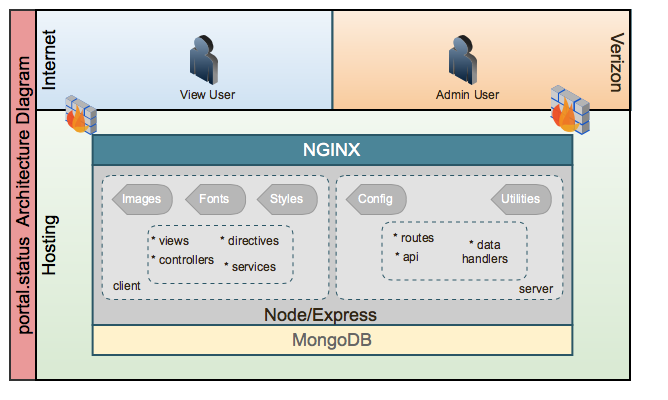

# Portal.Status

This is the Source Code Repository to be used for the **Verizon Digital Media Services Network Status Site.**

## Introduction
The Network Status Website is the website for Verizon Digital Media Services that conveys the information on what systems are up, down or in maintenance.


## Business Objectives
1. Redevelop the Edgecast status site to unveil a new look feel, ensure branding is consistant, and include an administration component that allows operations to log in and change the status.  This site will then consolidate the different status pages that are existing today.
	- [VDMS: http://status.verizondigitalmedia.com](http://status.verizondigitalmedia.com) (Currently Branded for VDMS)
	- [Edgecast: http://status.edgecast.com](http://status.edgecast.com) (Original Edgecast Network Status)
2. Existing code was developed in Python and utilizing a PostgreSQL DB.  Current technology stack is now one of Javascript and the code can also then be rewritten as a MEAN stack.
3. Operations today updates Status through the MCC in a method that is difficult. The desire is to provide an easier method for them to Update the Status Information.

## Project Contact List

Engineering            | Stake Holders
---------------------- | -------------------------------------
Srini Bhukya           | Francis Potter
Nitin Khana            | Candace Shelton
Steve Preston          | Gino Lang
Daniel Scholl          | Peeran Hussain

## Feature List

#### General Features
- Provide a link to Contact Support
- Provide a Status Overview to give a quick glance at network status.
	- Include a KPI for each Status Type and count.
- Support Searching for status by POP
- Support Filtering status by Status Type


#### Individual Product Status Details
- Support the ablitity to show different Product Status
	- CDN
	- Transact
	- Route
	- Uplynk (Live, Linear, VOD Streaming)
- Support the ability to show different Sub Categories for each Product *(HTTP Small, Large etc.)*
	- Each Sub Category should show status for POP.
		- Include POP Location and Service Status

			Status Type             |
			----------------------- |
			Ok                      |
			Scheduled Maintenance   |
			Performance Degredation |
			Not Applicable          |

- Show Specific Product Status News if available.
- Show Optional Portal Status

#### Network Status Administration
 - Authenticate users for Administrative Access
 - Administrative Functions:
 	- Select Items for Editing:
 		- By POP
 		- By Service
 		- Individually (Single or Multiple)
 	- Edit Current Status of Selected Items
 	- Update Network Status RSS Newsfeed

## Technical Requirements
- MEAN Stack  (Mongo, Express, Angular, Node)
- Domain: may / may not be VerizonDigitalMedia.com
- Responsive (1 breakpoint: Desktop)
- Browser requirements
	- Internet Explorer 11
	- Chrome 36
	- Firefox 30
	- Safari 7.0.5
- Device Requirements
	- None
- Page load time expectations
	- Under 3 seconds
- Scale and anticipated volume of traffic
	- Needs to be able to handle low usage patterns
- Environments
	- Development  -- Virtualized Vagrant
	- Production  -- Virtual Hosted
- Analytics
	- Integration with Google Analytics

## Security Requirements
- Only open ports exposed to the Internet are 80 and 22.
- Application Scanning may be performed prior to going live and randomly as needed by Rapid7 Nexpose or Qualys Application Scanner.
- The application should be secured against most of the top vulnerabilities identified by OWASP

#### Useful Security Resources for Node and Express
- TBD


## Technical Infrastructure

### Hardware/Software
The following requirements apply to the Production Hardware Installation.

FUNCTION			                    | Virtual Hardware
----------------------------------- | -----------------------------
Web Server (RackCloud)              | 2 CPU 2 Gig Memory

Table: Hardware Requirements.


The following requirements apply to the Software Installation.

COMPONENT			    | VERSION
----------------------------- | -----------------------------
Operating System					| Ubuntu  - **14.04 (x64)**
Configuration Management		| Chef - **11.16.0**
Web Server						| NGINX - **1.4.6**
Scripting Language				| Node - **0.10.26**
- Node Package Module			|  __*async*__
- Node Package Module			|  __*express*__
- Node Package Module			|  __*body-parser*__
- Node Package Module			|  __*ejs*__
- Node Package Module			|  __*errorhandler*__
- Node Package Module			|  __*express-session*__
Database						   | MongoDB - **2.0.2**

Table: Installed Software Required Versions.

### System Architecture Diagram

The architecture consists of a single server architecture.  The objectives of the architecture are to ensure ease of configuration and deployment, but allow the flexability that if desired could be moved to an HA redundant scenario.

1. Web/DB Server -- Active





### Design Documentation

1. [Graphical Visual Design - CDN](docs/Visual_cdn)
2. [DataModel Design](docs/Datamodel.md)


Development Environment
---------------

### Getting Started

marketing.cms DevOps uses Chef Solo provisioner. It means that your environment is built from the source code.

  1. Install VirtualBox
     [https://www.virtualbox.org/wiki/Downloads](https://www.virtualbox.org/wiki/Downloads)

  2. Install Vagrant
     [http://docs.vagrantup.com/v2/installation/index.html](http://docs.vagrantup.com/v2/installation/index.html)

  3. Install Required Vagrant Plugins
  	  -  vagrant-share (1.1.3)
  	  -  vagrant-omnibus (1.4.1)

  4. Configure your ssh key

  	  In the *chef/data\_bags/ssh* directory is a sample file for using your ssh key to inject into the box being built.  Copy the file to authorized_keys.json and ensure your public ssh key is in the file.

  5. Build your environment

     To build your environment in the chef directory execute the command:

     ```
     $ vagrant up
     ```

     Vagrant will start to build your environment. You'll see green status
     messages while Chef is configuring the system.

     >
     NOTE: Vagrant supports multiple providers for virtualization.  If you have different providers installed in your machine you can specify which provider to use.

     ```
        $ vagrant up --provider=virtualbox

        $ vagrant up --provider=vmware_fusion
     ```

 6. Visit [http://localhost:3080](http://localhost:3080) address and you'll see the
     network status page.

### Basic Usage


//TODO:  Put Notes here on how to clone the portal.status/deploy branch.

Vagrant's basic commands (should be executed inside DevOps directory):


* SSH into the virtual machine.
	```
	$ vagrant ssh
	```

* Start the virtual machine.
	```
	$ vagrant up
	```

* Stop the virtual machine.
	```
	$ vagrant halt
	```

* Destroy the virtual machine.
>
Destroy your virtual machine. Source code and content of data directory will remain unchangeable. VirtualBox machine instance will be destroyed only. You can build your machine again with 'vagrant up' command. The command is useful if you want to save disk space.

	```
	$ vagrant destroy
	```

* Configure virtual machine
>
Useful if you have overwriten a file that you want reset. ie: httpd.conf

	```
	$ vagrant provision
	```

* Reload the virtual machine.
>
Userful when you need to change network or synced folder settings.
	```
	$ vagrant reload
	```

Official Vagrant site has more documentation.
[http://docs.vagrantup.com/v2/](http://docs.vagrantup.com/v2/)


